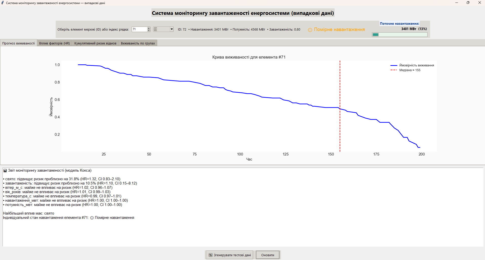
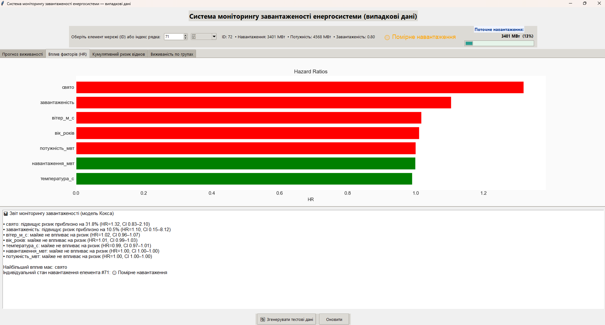
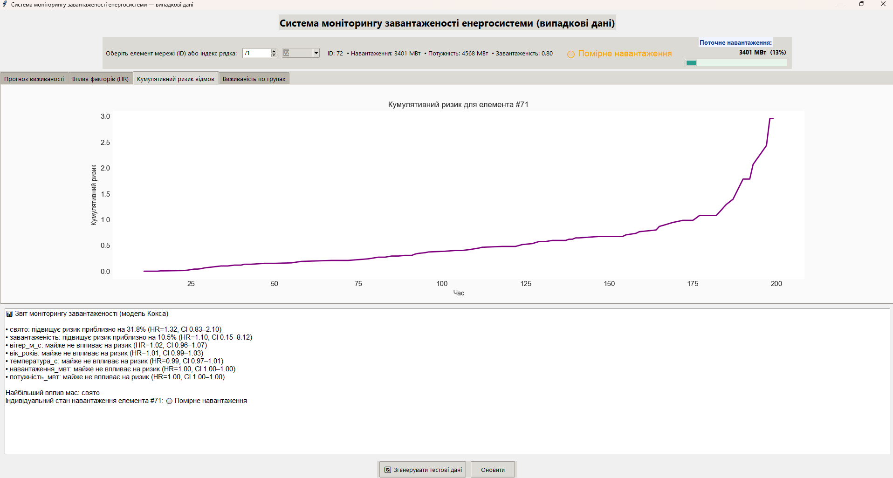
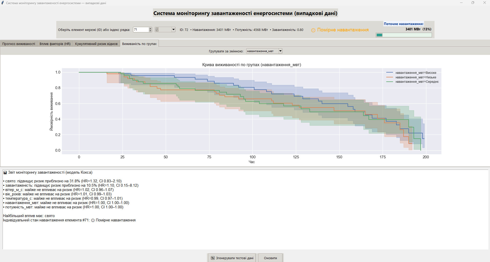

# Система моніторингу завантаженості енергосистеми

Коротко
- Невелика GUI-утиліта на Tkinter для візуалізації й аналізу ризику відмов/завантаженості елементів енергосистеми.
- Використовується модель Кокса (lifelines) для оцінки впливу факторів і прогнозу виживаності.

Особливості
- Прогноз виживаності, кумулятивний ризик і Hazard Ratios.
- Вибір елемента мережі за індексом або за ID.
- Коротка картка елемента (назва, тип, навантаження, потужність).
- Інтерактивні графіки, прогресбар поточного навантаження, детальна панель з повними даними.

Вимоги
- Python 3.8+ (рекомендовано 3.10+)
- Бібліотеки:
  - pandas
  - numpy
  - matplotlib
  - seaborn
  - lifelines
  - tkinter (зазвичай в комплекті з Python)

Швидка інсталяція залежностей:
```bash
pip install pandas numpy matplotlib seaborn lifelines
```

Запуск
```bash
python dashboardBetav1.py
```
- Скрипт намагається прочитати `cox_energy_dataset.csv` у тій самій теці. Якщо файл відсутній або неправильний — створюються тестові дані.

Формат CSV
- Очікуються колонки (українські назви):
  - `ід` — унікальний ідентифікатор елемента
  - `тривалість` — час спостереження / час до події
  - `подія` — 0/1 (подія відбулась)
  - `навантаження_мвт`, `потужність_мвт`, `завантаженість`, `температура_с`, `вітер_м_с`, `свято`, `вік_років`
- Якщо `назва` і `тип` відсутні — вони підставляються автоматично (згенеровані або інтерпретовані за потужністю).

Інтерфейс (коротко)
- Вибір елемента:
  - Combobox з `ID` та Spinbox з індексом рядка — обидва синхронізовані.
- Коротка картка: показує назву, тип, навантаження, потужність та завантаженість.
- Прогресбар праворуч — відображає поточне навантаження відносно мін/макс у наборі.
- Кнопки:
  - "Згенерувати тестові дані" — замінює набір даних випадковим.
  - "Оновити" — перерахунок і оновлення візуалізацій.
  - "Показати деталі" — відкриває повну картку даних елемента.

Screenshots

 1. Прогноз виживаності


 1. Вплив факторів (Hazard Ratios)


 1. Кумулятивний ризик відмов


 1. Виживаність по групах

